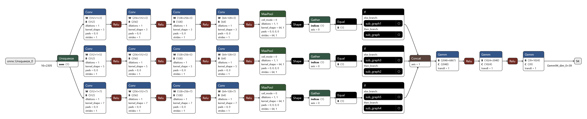

# Joint MK Classification of Stellar Spectra with Distance-Aware CNNs

This repository hosts code and other resources to reproduce the dataset compiled from public sets, training and evaluating models. We also share our dataset, model weights, extended figures and results.

## Authors
* Volga Sezen[^1]
* Alptekin Temizel[^1]

[^1]:Middle East Technical University, Graduate School of Informatics, Ankara, Turkey

## [Dataset](https://github.com/volgasezen/StellarClassification/tree/main/data)

Our dataset is made up of 5 spectral series from four observatory surveys. Datasets are shared as .fits files which can be read with [`astropy.io.fits`](https://docs.astropy.org/en/stable/io/fits/).

## Models

### Conv1D-v1
First iteration of the conv1d model had the following configuration:
* Number of filters: [512,256,128,64,32]
* Kernels of each branch: [3,5,7]
* Convolution strides for all: 1

### Conv1D-v2
The second iteration improved on scaling with a change of configuration and architecture:
* Number of filters: [32,128,512,2048,512,128,32]
* Kernels of each branch: [3,5,7]
* Convolution strides: [1,2,2,2,2,2,2]
* Instead of max_pooling, simple flattening used

### ResNet50-1D
The ResNet50 architecture was converted to use 1D convolutions and was trained from scratch.

### ConvTran
ConvTran architecture can be accessed from [this repository](https://github.com/Navidfoumani/ConvTran). It was initialized with embedding dimension of 64, hidden dimension of 256 and number of heads at 16.

### ConvKan
PyTorch implementation of ConvKAN models can be accessed from [this repository](https://github.com/IvanDrokin/torch-conv-kan). This model was initialized identically to Conv1D-v1.

# Results

Results show that while Resnet50-1D had better performance on luminosity class prediction, Conv1D-v2 had better performance when considering all other metrics. An ensemble of the two model responses via a mean of raw logits had the best results across all metrics.

Below metrics for methods tried are shown in tables, including comparisons to results in existing literature. Our method outperforms luminosity classification results, and provides competitive results in temperature classification.

| **Model** | **# params** | **F1 Macro** | **MAE** | **QWK (T)** | **QWK (L)** |
|---|---|---|---|---|---|
| Conv-KAN | 5M | 52.26 | 0.231 | 97.02 | 51.65 |
| ConvTran | 67k | 56.77 | 0.234 | 97.13 | 65.30 |
| Conv1D-v1 | 19M | 59.72 | 0.224 | 96.37 | 60.32 |
| ResNet50-1D | 16M | 58.43 | 0.197 | 97.15 | 68.96 |
| Conv1D-v2$ (α = 0.75) | 40M | 62.80 | 0.194 | 97.30 | 60.28 |
| Conv1D-v2$ (α = 0.5) | 40M | 60.91 | 0.217 | 96.66 | 52.63 |
| Conv1D-v2$ (α = 0) | 40M | 61.49 | 0.196 | 96.84 | 62.64 |
| Conv1D-v2$+ ResNet50-1D | 56M | **67.67** | **0.167** | **97.79** | **72.06** |

| **Method** | **I** | **II** | **III** | **IV** | **V** | **VI** |
|---|:---:|:---:|:---:|:---:|:---:|:---:|
| Sharma et al. | 0.775 | 0.171 | **0.823** | 0.273 | 0.809 | -- |
| Ours | **0.870** | **0.539** | 0.785 | **0.531** | **0.901** | 0.889 |

| **Method** | **O** | **B** | **A** | **F** | **G** | **K** | **M** |
|---|:---:|:---:|:---:|:---:|:---:|:---:|:---:|
| Sharma et al. | **1.00** | 0.93 | 0.90 | 0.88 | 0.85 | 0.80 | 0.93 |
| Ours | 0.94 | **0.96** | 0.93 | 0.88 | 0.84 | 0.87 | 0.96 |
| Wu et al. | -- | -- | **0.96** | 0.87 | 0.91 | **0.97** | **0.99** |
| Tan et al. | 0.99 | 0.94 | 0.90 | 0.89 | 0.90 | 0.93 | 0.97 |
| Shi et al. | 0.80 | 0.85 | 0.84 | **0.91** | **0.92** | 0.96 | 0.99 |

Detailed results with confusion matrices and individual-class scores are shared below:

| **Class** | **Precision** | **Recall** | **F1-Score** | **Support** |
|---|---|---|---|---|
| OI | 1.000000 | 0.833333 | 0.909091 | 6 |
| OII | 1.000000 | 0.500000 | 0.666667 | 2 |
| OIII | 0.500000 | 0.666667 | 0.571429 | 3 |
| OIV | 0.666667 | 0.666667 | 0.666667 | 3 |
| OV | 0.818182 | 0.818182 | 0.818182 | 11 |
| OVI | 1.000000 | 1.000000 | 1.000000 | 2 |
| BI | 0.769231 | 0.833333 | 0.800000 | 12 |
| BII | 0.789474 | 0.681818 | 0.731707 | 22 |
| BIII | 0.657895 | 0.757576 | 0.704225 | 33 |
| BIV | 0.780488 | 0.761905 | 0.771084 | 42 |
| BV | 0.923077 | 0.857143 | 0.888889 | 112 |
| BVI | 0.800000 | 1.000000 | 0.888889 | 4 |
| AI | 0.750000 | 1.000000 | 0.857143 | 3 |
| AII | 0.250000 | 0.250000 | 0.250000 | 4 |
| AIII | 0.333333 | 0.454545 | 0.384615 | 11 |
| AIV | 0.523810 | 0.511628 | 0.517647 | 43 |
| AV | 0.776699 | 0.784314 | 0.780488 | 102 |
| AVI | 1.000000 | 1.000000 | 1.000000 | 1 |
| FI | 0.555556 | 0.714286 | 0.625000 | 7 |
| FII | 0.500000 | 0.833333 | 0.625000 | 6 |
| FIII | 0.250000 | 0.142857 | 0.181818 | 7 |
| FIV | 0.194444 | 0.280000 | 0.229508 | 25 |
| FV | 0.733333 | 0.681416 | 0.706422 | 113 |
| FVI | 1.000000 | 1.000000 | 1.000000 | 1 |
| GI | 0.833333 | 0.625000 | 0.714286 | 8 |
| GII | 0.214286 | 0.300000 | 0.250000 | 10 |
| GIII | 0.630435 | 0.630435 | 0.630435 | 46 |
| GIV | 0.424242 | 0.437500 | 0.430769 | 32 |
| GV | 0.778761 | 0.739496 | 0.758621 | 119 |
| KI | 0.666667 | 1.000000 | 0.800000 | 4 |
| KII | 0.307692 | 0.500000 | 0.380952 | 8 |
| KIII | 0.865854 | 0.657407 | 0.747368 | 108 |
| KIV | 0.344828 | 0.476190 | 0.400000 | 21 |
| KV | 0.795181 | 0.891892 | 0.840764 | 74 |
| MI | 1.000000 | 0.923077 | 0.960000 | 13 |
| MII | 1.000000 | 1.000000 | 1.000000 | 1 |
| MIII | 0.877551 | 1.000000 | 0.934783 | 43 |
| MV | 0.978070 | 0.961207 | 0.969565 | 232 |
| MVI | 0.000000 | 0.000000 | 0.000000 | 1 |
| accuracy | 0.759846 | | | |
| macro avg | 0.674079 | 0.696698 | 0.676718 | 1295 |
| weighted avg | 0.775780 | 0.759846 | 0.764508 | 1295 |
